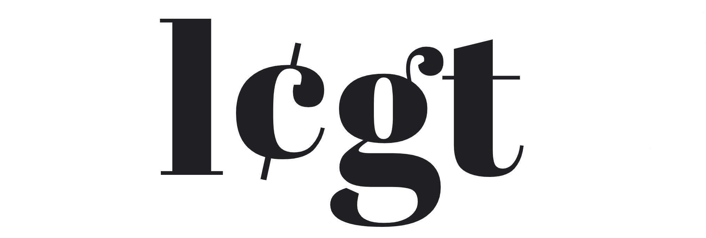

# Brand

\
The initial land and buildings that will serve as the campus, lab and jurisdiction for development of the LEGT DAO will be in Arecibo, Puerto Rico in partnership with my pre-existing Smart City Technology Fund [DAOhaus](https://daohaus.org) which has incubated the project up to this point and as such inherits key aspects of it's incubating parent's branding, namely the colors and shapes below.

\

****\
**DAO** - Both the acronym [for decentralized autonomous organizations](https://en.wikipedia.org/wiki/Decentralized\_autonomous\_organization), and also a spelling for the eastern spiritual path in search for the idealized the way human beings ought to behave in society and with nature.

**HAUS** - German for "house", the word has become a trendy staple in our zeitgeist. Its integration mixes well as our principal concern is with real assets and also holds space as describing an umbrella brand or firm.

When placed together it resembles the Bauhaus art movement that called for a return to fundamental design principles and idealized simplicity and basic form -similar to our mission for collective management of real world assets.\
\
The brand may be boiled down and shortened into the symbols circle square triangle "□∆○" being that they visually spell out D - A - O respectively or D with Stroke "Đ" to act as shorthand for DAO.\
\
Đ is an especially interesting character as it represents such things as the chemistry equivalent of decentralization called "disparity", the currency of the South Vietnamese, and many other uses that will ensure the symbol will be available and resonate with a global audience.

 (1).png>)
